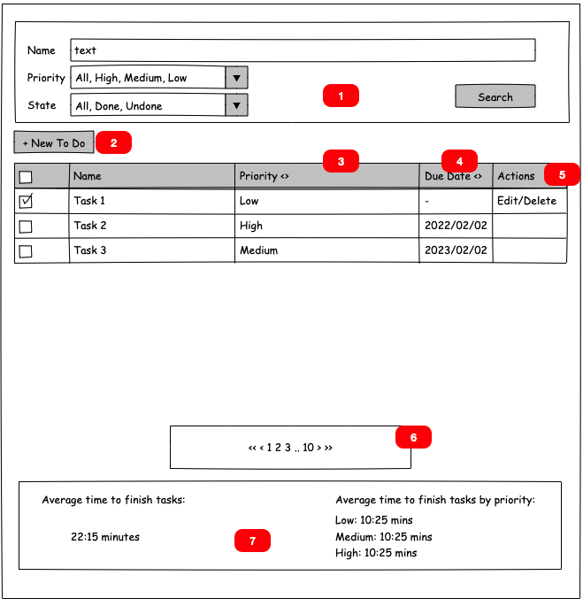

# To Do App Frontend

## Functional Requirements 

You are working with a client that needs to implement a to do list to help manage their tasks in their daily job. The client asked you to implement the following functionality: 

- Create a “to do” specifying the name, a priority, and possibly a due date 

- Ability to edit name, priority and due date for existing “to do” tasks. They want to be able to specify a due date or clear the due date (because they are not interested in when to finish that “to do”) 

- Be able to filter “to do’s” specifying the name (or part of the name), and the priority, and if they are done/undone. 

- Be able to sort the “to do’s” by priority and/or due date. For example, be able to sort items where their due date is soon and sort them also by priority to see what tasks are more urgent or less urgent 

- Mark “to do’s” as done (clicking in a checkbox) or to undone a “to do” - The undone functionality is just there if there is a mistake :D 

- Since it is possible that the client will have a lot of “to do’s” they need to paginate the list of “to do’s” 

- Ability to know, in average, the time between creation and done for all “to do’s”. This should be shown in general for all done “to do’s” and also grouped by priority. This is important for the client since this is a metric they follow to measure performance. 

## UI Requirements:

1. Search/Filtering Controls 

2. New To Do Button. This should open a modal to type the “to do” data. 

3. Priority column should show in the header the classic up and down arrows to allow the user to sort 

4. Due date column should show in the header the classic up and own arrows to allow the user to sort 

5. Action column to show actions (links/buttons) to allow the user to delete or edit a “to do”. To Edit is ok to show a modal similar to the one to create a “to do” 

6. Pagination control. Showing the pages, its number and the next and previous page is enough. 

7. Area to show the metrics 